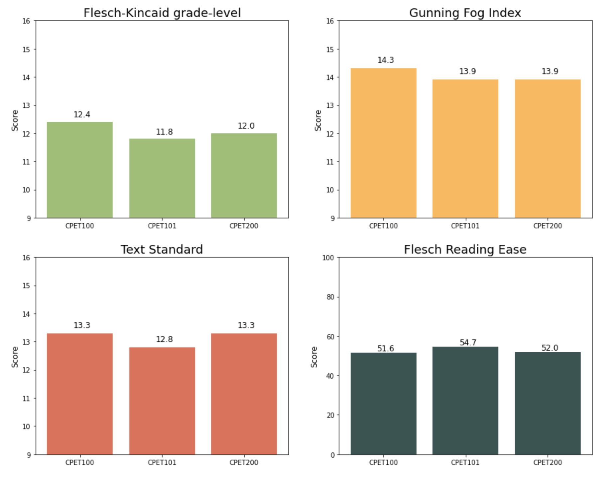

# An Analysis of ETE Discussion Posts

ETE is my 2-year university program where we routinely discuss problems and solutions around climate change, as well as the social and environmental impacts that climate change has had on the world at large. A way to keep us thinking about issues is through weekly discussion posts, in which we're presented a new or recurring topic (like regenerative agriculture, nuclear energy, sustainable cities, biomimicry, and more) accompanied with a few articles containing stories, facts, or opinions around those topics, and are asked to give our thoughts. This notebook/repo analyzes changes in word count and lexical richness + readability through the first 3 semesters. 

--- 

## Findings

- We're writing (on avg.) 20% more each semester. Mean words jumped by 100 from ~240 to ~340 across 3 semesters. Median words jumped by ~80 in the same span, about a 36% increase
- Our vocabulary gets better each semester (lexical richness, measured by MTLD) 
- Our sentence/word length (lexical readability) stays relatively the same - perhaps a good thing
- (In my opinion) it seems like we're writing with a slightly broader vocabulary, but not making our sentences overly complex, rather we're keeping them accessible to the average reader (which in my opinion is the best scenario).

### Looking at word count

- **Mean + median word counts, per semester**
  - Certainly increasing every semester (about a 10-25% increase/sem)
  - Mean is biased up, so I'll use median as measure of centrality

- **Word count distributions, per semester**
  - We see left skew that pulls the mean up
  - Variance in word count increases every semester - maybe we're finding more interest in the readings & thus write more.

Fun note: our 3-semester progression is almost indistinguishable from a 3 complexity-level progression of writings from children ages 7-16. The histograms below at least shows us that the pattern we see in ETE is also seen with other people - so this isn't an isolated event.

---

### Measures of Complexity

- **Lexical Readability**
  - Lexical readability mainly accounts for sentence and word length - tries to quantify how 'hard' or 'easy' a text is to read.  
  - Each metric outputs an American K-12 grade level of readability, so ~13 means a college freshman is easily able to read the texts.
  - Text Standard is the most comprehensive measure out of the 4, so it appears we're not over complicating our texts over our 3 semesters.

- **Lexical Richness**
  - Instead of text length, richness tries to measure vocabulary.
  - A common metric is TTR, which is the % of unique words in a text - this of course is biased towards shorter texts.
  - Although TTR goes down every semester, we've seen our text length goes up.
  - A better metric that avoids this bias is MTLD, which we see increases every semester, implying our true vocabulary is improving.

(Note that the ranges)

## Conclusion

It seems like we're writing with a slightly boarder vocabulary, but not making our sentences overly complex, rather we're keeping them accessible to the average reader (which in my opinion is one of the better possible scenarios).
